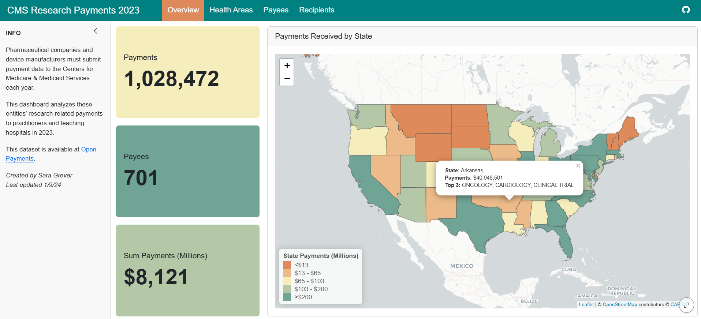

# CMS Research Payments 

## Background 

Pharmaceutical companies and device manufacturers must submit disclose payments to the Centers for Medicare & Medicaid Services annually. 

This Quarto dashboard analyzes research payments made to practitioners and institutions in 2023. It is intended for health professionals, journalists, and curious members of the public to see which disciplines receive high research activity, and who are key funding recipients.    

### Preview  

## Data  

The following datasets are leveraged:  

* [CMS Open Payments](https://openpaymentsdata.cms.gov/) for research in 2023
* [rnaturalearth](https://github.com/ropensci/rnaturalearth) United States polygons  

## Tools 

### R Version  

This webpage was built with R 4.3.1 and R Studio 2024.12.0.467. 

### Packages  

Data import and wrangling:  

* data.table  
* dplyr  
* janitor 
* tidyr  
* forcats  

String manipulation:  

* stringr 
* glue  
* tidytext  

Visualization and tables:  

* ggplot2  
* ggwordcloud  
* scales
* rnaturalearth  
* leaflet  
* DT  